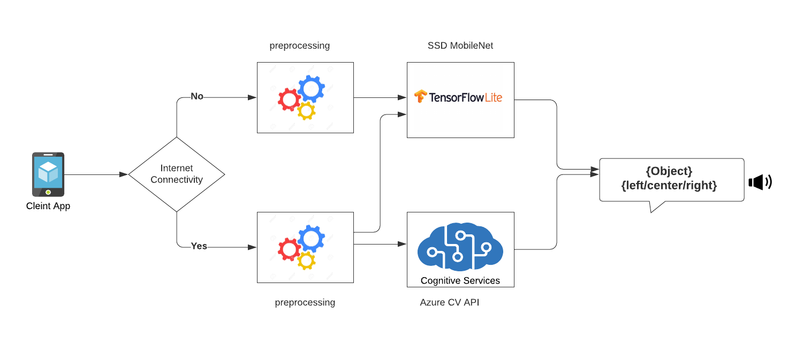

# DeepSpecs
---
## Problem statement:

People with blindness have difficulties identifying what is in around without touching or asking someone. This creates challenges, especially when there's no one to assist or if the object in front of them is not to be touched(hot tea or knife etc.). Solution should understand the requirements of the users and building an image recognition system to help them navigate.

---

## Solution:  
An Android Application which will let visually impaired users to know about the surrounding and localize objects within the given frame of picture and it should work in offline as well as online mode.

### Solution Design:

---

Members:

* [Ayush Kumar](https://github.com/AK-ayush)
* [Mayur Madnani](https://github.com/mayurmadnani)
* [Shweta Pandey](https://github.com/bomila) 

